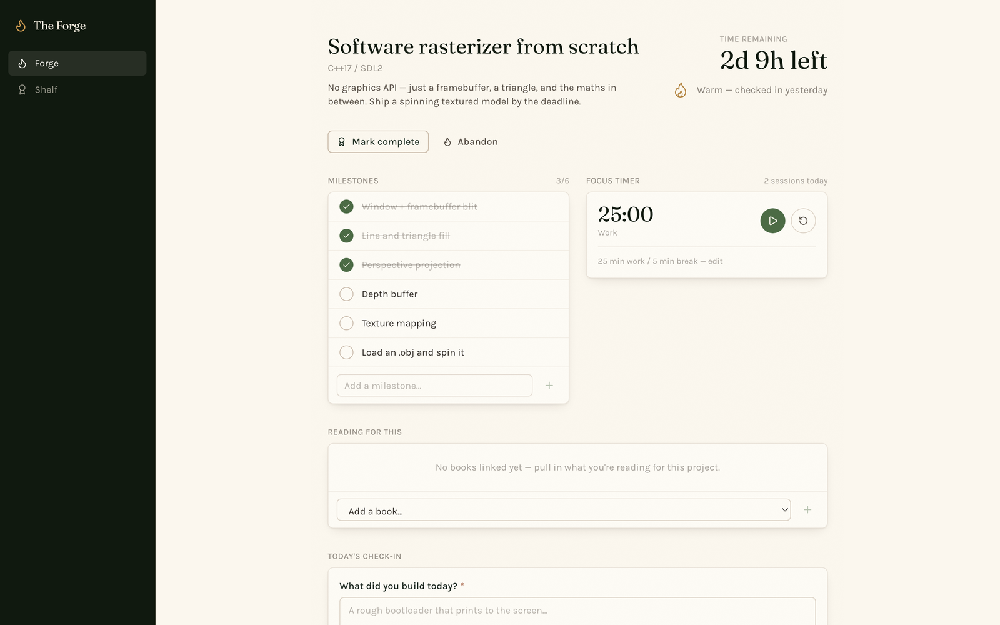

# The Forge

> Where the cabin builds under pressure.

A deliberately narrow project tracker: **one** active project, **one** deadline, a countdown, and a daily log. Everything about it is arranged so you can't hide from the date.



## What it does

**One project at a time.** Only a single project is ever ACTIVE — enforced in the application layer, not the schema — so the dashboard never has to juggle more than one countdown. Finishing or abandoning one asks for a retro before you're allowed to start the next.

**Milestones** break the goal into an ordered list you tick off.

**Check-ins** are one short entry per project per day: what got built, what blocked you, what you learned. Re-submitting the same day edits it rather than piling up, so the log stays one row per day.

**A focus timer** runs work/break sessions right on the dashboard, and each completed one is logged against the project — the substrate behind the Shelf's session totals.

**Temper** reads how recently you've checked in and says so plainly — warm when you were here yesterday, cooling when you weren't. It's the one nag in the app, and it's the honest kind.

**Shelf** links books from Reading Cabin as fuel for the project, fetched live rather than cached.

## Stack

Next.js 16 (App Router) · React 19 · TypeScript · Tailwind 4 · Prisma + SQLite.

## Running it

```bash
npm install
npx prisma db push
npm run dev
```

Then open <http://localhost:3005>. The database lives at `~/Library/Application Support/The Forge/the-forge.db`, outside the repo.

## The cabin

Part of a set of local-first apps launched from [The Lodge](https://github.com/CamWhamBammus/the-lodge). For work that doesn't fit a single deadline, see [The Foundry](https://github.com/CamWhamBammus/the-foundry).
